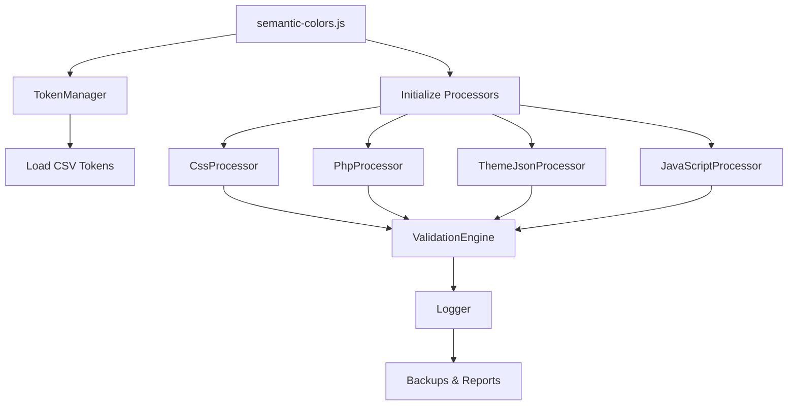

# 🏗️ Arquitetura Modular - Sistema de Tokens Semânticos

## 📂 Estrutura do Projeto

```
_tools/
├── 🎯 semantic-colors.js       # Ponto de entrada principal
├── 📁 processors/              # Processadores específicos por tipo
│   ├── BaseProcessor.js        # Interface base para todos os processadores
│   ├── CssProcessor.js         # Processamento de arquivos CSS
│   ├── PhpProcessor.js         # Processamento de arquivos PHP
│   ├── ThemeJsonProcessor.js   # Processamento de theme.json
│   └── JavaScriptProcessor.js  # Processamento de arquivos JavaScript
├── 📁 utils/                   # Utilitários compartilhados
│   ├── TokenManager.js         # Gerenciamento central de tokens CSV
│   ├── Logger.js               # Sistema de logging estruturado
│   └── CsvParser.js            # Parser especializado para CSV
├── 📁 config/                  # Configurações do sistema
│   ├── color-mapping.js        # Mapeamento de cores (legacy/backup)
│   ├── processing-matrix.js    # Matriz de decisão de processamento
│   └── settings.js             # Configurações globais
├── 📁 validators/              # Validação e verificação
│   └── ValidationEngine.js    # Motor de validação pós-processamento
├── 📁 docs/                    # Documentação técnica
├── 📁 templates/               # Templates para integração
├── 📁 backups/                 # Backups automáticos (gerado dinamicamente)
└── 📁 logs/                    # Logs de execução (gerado dinamicamente)
```

## 🔧 Design Patterns Implementados

### 1. **Processor Pattern** 
Cada tipo de arquivo tem seu processador especializado herdando de `BaseProcessor`:

```javascript
BaseProcessor
├── CssProcessor      # Processar .css
├── PhpProcessor      # Processar .php  
├── ThemeJsonProcessor # Processar theme.json
└── JavaScriptProcessor # Processar .js
```

### 2. **Strategy Pattern**
A `processing-matrix.js` define estratégias baseadas no tamanho/tipo do arquivo:

```javascript
// Exemplo: Arquivos CSS grandes usam PostCSS, pequenos usam String Replace
const strategy = ProcessingMatrix.getStrategy(fileSize, fileType);
```

### 3. **Singleton Pattern**
`TokenManager` gerencia tokens de forma centralizada:

```javascript
const tokenManager = new TokenManager(csvPath);
const tokens = tokenManager.getTokens(); // Cache interno
```

## 🎯 Fluxo de Processamento



## 🔀 Extensibilidade

### Adicionar Novo Processador

1. **Criar o processador:**
```javascript
// _tools/processors/SassProcessor.js
class SassProcessor extends BaseProcessor {
  async processFile(filePath, content) {
    // Implementar lógica específica para SASS
  }
}
```

2. **Registrar no pipeline:**
```javascript
// _tools/semantic-colors.js
const sassProcessor = new SassProcessor(logger);
processors.sass = sassProcessor;
```

### Adicionar Nova Configuração

```javascript
// _tools/config/settings.js
const NEW_FEATURE = {
  enabled: true,
  options: { /* ... */ }
};
```

## 📊 Responsabilidades

| Componente | Responsabilidade |
|------------|------------------|
| `semantic-colors.js` | Orquestração, CLI, pipeline principal |
| `BaseProcessor.js` | Interface comum, validação, backup |
| `*Processor.js` | Lógica específica de processamento |
| `TokenManager.js` | Gestão de tokens, mapeamentos, CSV |
| `Logger.js` | Logging estruturado, relatórios |
| `ValidationEngine.js` | Verificação pós-processamento |
| `ProcessingMatrix.js` | Estratégias de otimização |

## 🛡️ Princípios Arquiteturais

### ✅ **Single Responsibility**
Cada classe tem uma responsabilidade específica e bem definida.

### ✅ **Open/Closed** 
Extensível para novos processadores sem modificar código existente.

### ✅ **Dependency Injection**
Processadores recebem dependências via construtor (Logger, TokenManager).

### ✅ **Interface Segregation**
`BaseProcessor` define interface mínima, processadores implementam especificidades.

### ✅ **Don't Repeat Yourself (DRY)**
Funcionalidades comuns centralizadas em `BaseProcessor` e utilitários.

## 🔄 Ciclo de Vida

1. **Inicialização:** Carregamento de configurações e tokens
2. **Descoberta:** Encontrar arquivos para processamento
3. **Processamento:** Aplicar transformações via processadores
4. **Validação:** Verificar integridade dos resultados
5. **Finalização:** Backups, logs e relatórios

## 🧪 Testabilidade

A arquitetura permite testes unitários isolados:

```javascript
// Testar processador isoladamente
const processor = new CssProcessor();
const result = await processor.processFile(filePath, content);
assert.equal(result.includes('semantic-token'), true);
```

## 📈 Performance

- **Lazy Loading:** Tokens carregados apenas quando necessário
- **Caching:** Resultados de parsing cachados
- **Strategy Pattern:** Otimizações baseadas no tamanho do arquivo
- **Parallel Processing:** Opção de processamento paralelo

## 🔐 Segurança

- **Backup Automático:** Todos os arquivos são salvos antes da modificação
- **Validação:** Verificação de integridade pós-processamento
- **Rollback:** Possibilidade de reverter via backups
- **Logs Detalhados:** Rastreabilidade completa das operações

---

**Versão da Arquitetura:** v0.4.2  
**Última Atualização:** 2025-08-26  
**Padrão:** Modular, Extensível, Testável
